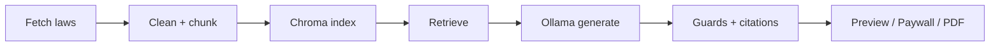

# WIDERSPRUCH.JETZT

**RAG-assisted formal *Widerspruch* drafts for German Jobcenter decisions (SGB II + SGB X).**

> Document assistance only — **not legal advice**. No attorney–client relationship is created.

[](#)
[](#)
[](#)
[](#tests)

**Live demo:** _add public URL after deploy_ · **Demo video:** _add Loom link here_  
**Sample letter:** [`samples/letter_example.txt`](samples/letter_example.txt)  
**Architecture:** [`docs/ARCHITECTURE.md`](docs/ARCHITECTURE.md) · **Demo guide:** [`docs/DEMO.md`](docs/DEMO.md) · **Deploy:** [`docs/DEPLOY.md`](docs/DEPLOY.md) · **Case study:** [`docs/PORTFOLIO.md`](docs/PORTFOLIO.md)

### Recruiter-friendly demo (HuggingFace + Docker)

```bash
# 1) HF token in .env  (https://huggingface.co/settings/tokens)
# 2) data/chroma must exist (prebuilt index)
# 3) one command:
docker compose --profile demo up --build
# UI: http://127.0.0.1:8008/ui/   (DEMO_MODE: preview free, no Stripe)
```

| Mode | Env | When |
|------|-----|------|
| Local quality | `LLM_PROVIDER=ollama` | your machine |
| Portfolio demo | `LLM_PROVIDER=huggingface` + `DEMO_MODE=true` | recruiters / public URL |

---

## Problem

Jobcenter notices (sanctions, benefit reductions, missed appointments) are hard to read. Deadlines are short. Many people lose money because they fail to respond **formally and on time**.

## What this project does

End-to-end product that:

1. **Ingests** official German statute pages (SGB II / SGB X)
2. **Indexes** them with multilingual embeddings (E5) in Chroma
3. **Retrieves** grounded paragraphs for a user case
4. **Generates** a formal administrative letter via local Ollama LLM
5. **Hardens** the output with citation allowlists, claim softening, and domain guards
6. **Ships** a UI + preview/paywall (Stripe) + beta magic links + TXT/PDF export

### What it does **not** do

- ❌ legal advice / individual legal assessment  
- ❌ representation before authorities or courts  
- ❌ outcome guarantees  

---

## Engineering highlights (portfolio)

| Capability | Where |
|------------|--------|
| Modular FastAPI app | `app/` |
| RAG retrieval + distance filters | `app/rag/retrieve.py` |
| Citation allowlist / illegal § strip | `app/rag/citations.py` |
| Multi-stage generation safety pipeline | `app/generation/pipeline.py` |
| Strong-claim softeners & topic guards | `app/generation/guards.py` |
| Stripe checkout + webhook credits | `app/billing/access.py` |
| HMAC beta tester tokens | `app/testers/tokens.py` |
| Offline statute pipeline | `src/` |
| Unit tests (no GPU/LLM required) | `tests/` |
| Dockerized API | `Dockerfile`, `docker-compose.yml` |



---

## Project structure

```text
app/                 # Runtime API (modular monolith)
  main.py            # FastAPI entry
  rag/               # Retrieve + citations
  generation/        # Prompts, guards, pipeline
  billing/           # Stripe + credits
  testers/           # Beta magic links
  routes/            # HTTP endpoints
src/                 # Offline ingest → index pipeline
ui/                  # Vanilla HTML/CSS/JS product UI
tests/               # pytest unit tests
samples/             # Example letter + API payloads
docs/                # Architecture, demo, portfolio notes
scripts/             # Demo curl helpers
serve.py             # Thin compatibility shim → app.main:app
```

---

## Quickstart (local)

### 1. Python env

```bash
python -m venv .venv
# Windows
.venv\Scripts\activate
# Linux/macOS
# source .venv/bin/activate

pip install -r requirements.txt
copy .env.example .env   # Windows
# cp .env.example .env
```

### 2. Build the law index (once)

Requires network access to [gesetze-im-internet.de](https://www.gesetze-im-internet.de/):

```bash
python src/fetch_sgb2.py
python src/fetch_sgbx.py
python src/clean.py
python src/chunk.py
python src/index.py
```

This creates `data/chroma` (gitignored).

### 3. Start Ollama

```bash
ollama pull qwen2.5:14b-instruct
# Ollama must serve http://127.0.0.1:11434
```

### 4. Run the API

```bash
uvicorn app.main:app --host 127.0.0.1 --port 8008 --reload
```

- UI: http://127.0.0.1:8008/ui/  
- OpenAPI: http://127.0.0.1:8008/docs  
- Health: http://127.0.0.1:8008/health  

Compatibility shim (same app):

```bash
uvicorn serve:app --port 8008
```

### 5. Demo script

```powershell
.\scripts\demo_curl.ps1
```

---

## Docker

Build index on the host first (or mount an existing `data/` directory), then:

```bash
docker compose up --build
```

The container expects:

- `./data` mounted (Chroma + runtime JSON)
- Ollama on the host (`OLLAMA_URL=http://host.docker.internal:11434/api/generate`)

First request may download the E5 embedding model inside the container (slow once).

---

## Tests

Pure unit tests (citations, guards, billing helpers) — **no Ollama/Chroma required**:

```bash
pip install -r requirements-dev.txt
pytest -q
```

CI runs the same suite (see `.github/workflows/ci.yml`).

---

## Main API endpoints

| Method | Path | Purpose |
|--------|------|---------|
| GET | `/health` | Chroma + Ollama status |
| GET | `/search?q=` | Vector hits over law chunks |
| POST | `/widerspruch/workflow?preview=1` | Free preview (no credit) |
| POST | `/widerspruch/workflow?download=1` | Paid download (consumes credit) |
| POST | `/billing/checkout` | Stripe Checkout session |
| POST | `/billing/webhook` | Stripe webhooks |
| POST | `/t/{token}/widerspruch/workflow` | Beta tester path |
| GET | `/tester/whoami` | Beta token identity |
| POST | `/tester/mint` | Create beta magic link (admin) |
| POST | `/feedback` | SMTP feedback |

Example preview body: [`samples/api_request_example.json`](samples/api_request_example.json)

---

## Configuration

See [`.env.example`](.env.example). Important keys:

| Variable | Meaning |
|----------|---------|
| `OLLAMA_URL` / `OLLAMA_MODEL` | Local LLM endpoint |
| `CHROMA_COLLECTION` | Default `laws_de` |
| `STRIPE_*` | Optional payments |
| `TESTER_SECRET` / `ADMIN_SECRET` | Optional beta links |
| `SMTP_*` | Optional feedback email |

---

## Limitations (honest)

- Credit/subscription store is **JSON on disk** (fine for demo, not multi-instance production).
- Chunking is fixed-size; SGB II paragraph metadata can be incomplete.
- Letter quality depends on local model + retrieval; there is no large offline eval harness yet.
- Product sits in a legally sensitive domain — always frame as **document assistance**.

### Sensible next steps

1. Postgres for billing + webhook idempotency  
2. Structure-aware § chunking  
3. Hybrid retrieval (BM25 + vector) / re-ranker  
4. Golden-set eval for citations & claim softness  

---

## Legal notice

This software provides **document assistance only** and does not constitute legal advice.  
Use of this software does not create an attorney–client relationship.

Product disclaimer pages: `/impressum`, `/datenschutz` (when UI is served).

---

## Author

Built as a full-stack applied RAG product (ingest → retrieve → generate → monetize).  
See [`docs/PORTFOLIO.md`](docs/PORTFOLIO.md) for the case-study narrative (EN + RU).
