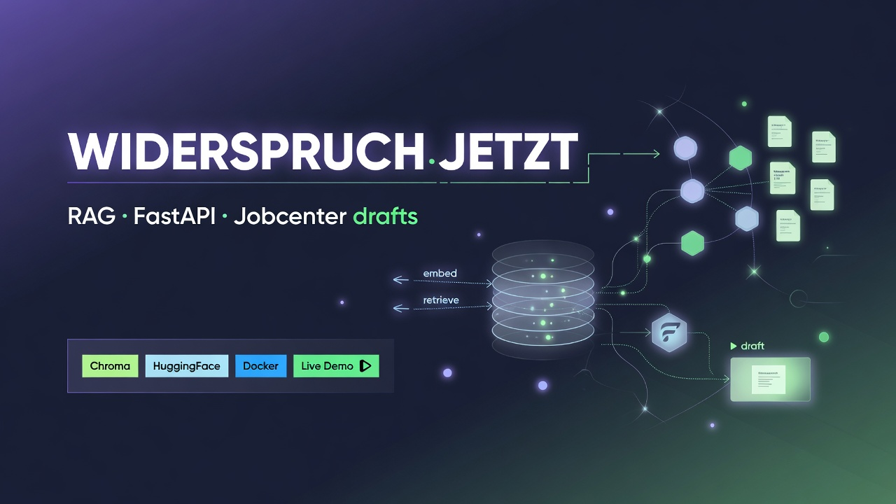
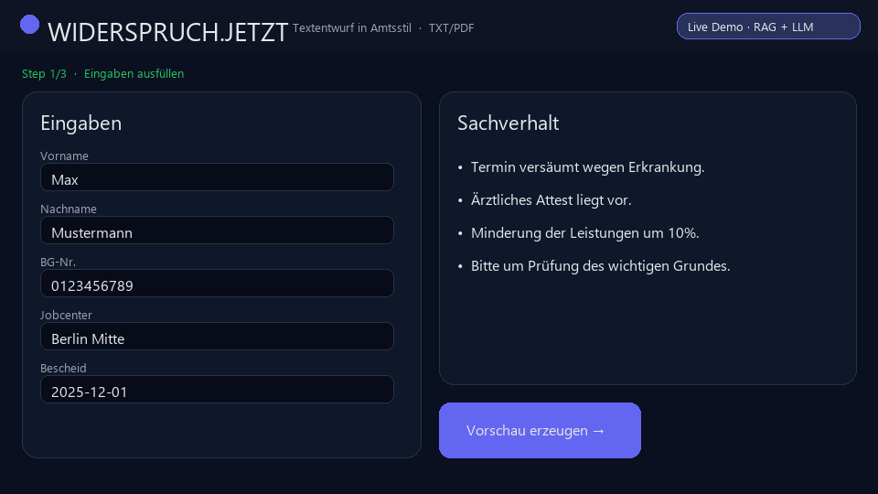
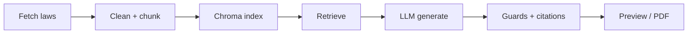

# WIDERSPRUCH.JETZT

**RAG-assisted formal _Widerspruch_ drafts for German Jobcenter decisions (SGB II + SGB X).**

> Document assistance only — **not legal advice**. No attorney–client relationship is created.

[](https://sgb2-rag-production.up.railway.app/ui/)
[](https://sgb2-rag-production.up.railway.app/health)
[](#)
[](#)
[](#)
[](#)

<p align="center">
  
</p>

<p align="center">
  
</p>

<p align="center">
  <b><a href="https://sgb2-rag-production.up.railway.app/ui/">Open Live Demo</a></b>
  ·
  <a href="https://sgb2-rag-production.up.railway.app/health">/health</a>
  ·
  <a href="https://sgb2-rag-production.up.railway.app/live">/live</a>
  ·
  <a href="samples/letter_example.txt">Sample letter</a>
</p>

|               |                                                                                                                                |
| ------------- | ------------------------------------------------------------------------------------------------------------------------------ |
| **Live demo** | https://sgb2-rag-production.up.railway.app/ui/                                                                                 |
| **API root**  | https://sgb2-rag-production.up.railway.app/                                                                                    |
| **Docs**      | [Architecture](docs/ARCHITECTURE.md) · [Demo guide](docs/DEMO.md) · [Deploy](docs/DEPLOY.md) · [Case study](docs/PORTFOLIO.md) |

**Try it:** open the live demo → click **Beispiel** → **Vorschau**.  
First request after idle may take 20–60s (cold start + HuggingFace).

---

## Problem

Jobcenter notices (sanctions, benefit reductions, missed appointments) are hard to read. Deadlines are short. Many people lose money because they fail to respond **formally and on time**.

## What this project does

End-to-end product that:

1. **Ingests** official German statute pages (SGB II / SGB X)
2. **Indexes** them with multilingual embeddings (E5) in Chroma
3. **Retrieves** grounded paragraphs for a user case
4. **Generates** a formal letter via LLM (Ollama locally / HuggingFace in the cloud demo)
5. **Hardens** output with citation allowlists, claim softening, and domain guards
6. **Ships** a UI + preview/paywall (Stripe) + beta magic links + TXT/PDF export

### What it does **not** do

- legal advice / individual legal assessment
- representation before authorities or courts
- outcome guarantees

---

## Engineering highlights (portfolio)

| Capability                                 | Where                        |
| ------------------------------------------ | ---------------------------- |
| Modular FastAPI app                        | `app/`                       |
| RAG retrieval + distance filters           | `app/rag/retrieve.py`        |
| Remote HF embeddings (no torch on Railway) | `app/rag/embeddings.py`      |
| Citation allowlist / illegal § strip       | `app/rag/citations.py`       |
| Multi-stage generation safety pipeline     | `app/generation/pipeline.py` |
| Strong-claim softeners & topic guards      | `app/generation/guards.py`   |
| Stripe checkout + webhook credits          | `app/billing/access.py`      |
| HMAC beta tester tokens                    | `app/testers/tokens.py`      |
| Offline statute pipeline                   | `src/`                       |
| Unit tests (no GPU/LLM required)           | `tests/`                     |
| Dockerized API + Railway deploy            | `Dockerfile`, `railway.toml` |



---

## Quickstart (local)

```bash
python -m venv .venv
# Windows: .venv\Scripts\activate
pip install -r requirements-local.txt   # includes embeddings for indexing
copy .env.example .env                  # set HF_TOKEN or use Ollama

# If you need to rebuild the index (prebuilt data/chroma ships for demo):
# python src/fetch_sgb2.py && python src/fetch_sgbx.py && python src/clean.py && python src/chunk.py && python src/index.py

uvicorn app.main:app --host 127.0.0.1 --port 8008
```

- UI: http://127.0.0.1:8008/ui/
- OpenAPI: http://127.0.0.1:8008/docs

### Modes

| Mode            | Env                                                          | When                        |
| --------------- | ------------------------------------------------------------ | --------------------------- |
| Local quality   | `LLM_PROVIDER=ollama`, `EMBEDDING_PROVIDER=local`            | your machine                |
| Cloud / Railway | `LLM_PROVIDER=huggingface`, `EMBEDDING_PROVIDER=huggingface` | public demo                 |
| Portfolio DEMO  | `DEMO_MODE=true`                                             | free preview without Stripe |

### Docker demo profile

```bash
# HF_TOKEN in .env (fine-grained + Inference Providers)
docker compose --profile demo up --build
```

---

## Tests

```bash
pip install -r requirements-dev.txt
pytest -q
```

---

## Main API endpoints

| Method | Path                               | Purpose                          |
| ------ | ---------------------------------- | -------------------------------- |
| GET    | `/live`                            | Lightweight liveness             |
| GET    | `/health`                          | Chroma + LLM readiness           |
| GET    | `/config`                          | UI flags (demo banner)           |
| GET    | `/search?q=`                       | Vector hits                      |
| POST   | `/widerspruch/workflow?preview=1`  | Free preview                     |
| POST   | `/widerspruch/workflow?download=1` | Download (credits / demo policy) |
| POST   | `/billing/*`                       | Stripe (optional)                |
| POST   | `/t/{token}/widerspruch/workflow`  | Beta tester path                 |

Example body: [`samples/api_request_example.json`](samples/api_request_example.json)

---

## Project structure

```text
app/                 # Runtime API (modular monolith)
docs/assets/         # Banner + demo GIF for README
samples/             # Example letter + API payloads
src/                 # Offline ingest → index pipeline
tests/               # pytest
ui/                  # Vanilla product UI
Dockerfile           # Railway-ready (chroma baked in)
```

Regenerate the demo GIF:

```bash
python scripts/make_demo_gif.py
```

---

## Configuration

See [`.env.example`](.env.example). Important keys:

| Variable             | Meaning                                         |
| -------------------- | ----------------------------------------------- |
| `LLM_PROVIDER`       | `ollama` \| `huggingface`                       |
| `EMBEDDING_PROVIDER` | `auto` \| `local` \| `huggingface`              |
| `HF_TOKEN`           | Fine-grained token with **Inference Providers** |
| `DEMO_MODE`          | Free preview, optional download gate            |
| `APP_URL`            | Public base URL                                 |

HF token with correct permission:  
https://huggingface.co/settings/tokens/new?ownUserPermissions=inference.serverless.write&tokenType=fineGrained

---

## Limitations (honest)

- Cloud demo depends on HuggingFace free-tier limits and cold starts
- Credit store is JSON on disk (not multi-instance production)
- Fixed-size chunking; SGB II § metadata can be incomplete
- Always frame as **document assistance**, not a law firm

---

## Evaluation

Retrieval-only seed (no letter / LLM-as-judge). Self-labeled 5 Jobcenter cases in [`app/eval/data/gold_retrieval.json`](app/eval/data/gold_retrieval.json). Hit@3 if the gold § appears in `GET /search` top-3 (filename / text — SGB II `paragraph` metadata is often empty).

| Case | Topic | Gold § | Short keyword query | Full case text | Query + gold § |
|------|--------|--------|---------------------|----------------|----------------|
| 001 | Pflichtverletzung / Kürzung | SGB II 31 / 31a / 31b | miss (SGB X refund / authority) | **hit** (31, 31a) | **hit** (31b) |
| 002 | Meldeversäumnis | SGB II 32 | miss (SGB X) | miss (SGB X procedure) | **hit** |
| 003 | Auskunft Dritter | SGB II 60 | miss (§ 22 housing) | miss (§ 22) | **hit** |
| 004 | Akteneinsicht | SGB X 25 | **hit** | — | — |
| 005 | Nichtigkeit | SGB X 40 | **hit** | — | — |

**Scores (Hit@3).** Short queries **2/5**. Full case text **3/5** (001 flips to hit). Adding the gold § recovers every previous miss — the statute is in the index.

**What failed.** Distinctive legal wording (Akteneinsicht, Nichtigkeit) matches. Everyday phrasing retrieves a nearby but wrong chunk (SGB X procedure, or § 22 KdU instead of § 60). Longer text is not enough when *Bescheid/Widerspruch* or *Wohnsituation* dominate.

**Takeaway.** Bottleneck is **query–statute matching**, not a missing document. Next lever is query construction (topic terms, don’t let procedure/housing drown the material §). Do not treat gold-§-in-query as the product metric. `DISTANCE_CUTOFF` / chunk size are not the first knob.

---

## Legal notice

This software provides **document assistance only** and does not constitute legal advice.  
Use does not create an attorney–client relationship.

---

## Author

Built as a full-stack applied RAG product (ingest → retrieve → generate → deploy).  
Case study: [`docs/PORTFOLIO.md`](docs/PORTFOLIO.md)

**Live:** https://sgb2-rag-production.up.railway.app/ui/
